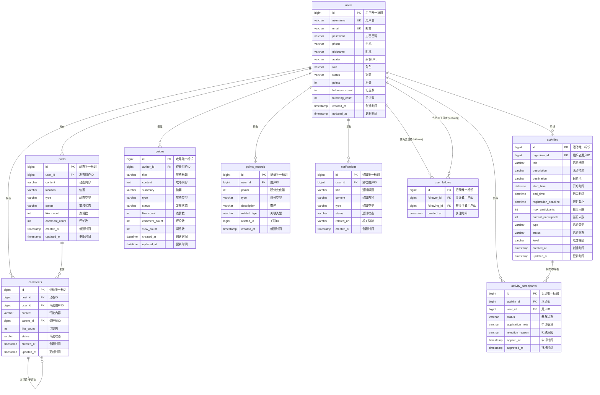
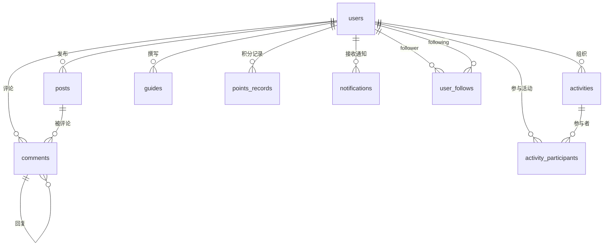

# 旅游 App 数据库 ER 图（基于 9 张核心表）

## 实体关系图（Mermaid）

以下 ER 图基于：用户、动态、活动、攻略、评论、积分记录、活动参与者、用户关注、通知 共 9 张表。

## 关系说明

| 关系 | 类型 | 说明 |
|------|------|------|
| **users → posts** | 1 : N | 一个用户可发布多条动态 |
| **users → activities** | 1 : N | 一个用户可组织多个活动（organizer_id） |
| **users → guides** | 1 : N | 一个用户可撰写多篇攻略（author_id） |
| **users → comments** | 1 : N | 一个用户可发表多条评论 |
| **users → points_records** | 1 : N | 一个用户有多条积分记录 |
| **users → activity_participants** | 1 : N | 一个用户可参与多个活动 |
| **users → notifications** | 1 : N | 一个用户可接收多条通知 |
| **users ↔ users（user_follows）** | N : M | 用户之间多对多关注（关注者-被关注者） |
| **posts → comments** | 1 : N | 一条动态可有多条评论 |
| **comments → comments** | 1 : N | 评论自关联，支持多级回复（parent_id） |
| **activities → activity_participants** | 1 : N | 一个活动可有多个参与者 |

## 简版 ER 图（仅实体与连线）

若渲染属性过多导致显示异常，可使用下方仅含实体与关系的简版：

## 外键汇总

| 从表 | 外键字段 | 主表 | 主键 |
|------|----------|------|------|
| posts | user_id | users | id |
| activities | organizer_id | users | id |
| guides | author_id | users | id |
| comments | user_id | users | id |
| comments | post_id | posts | id |
| comments | parent_id | comments | id |
| points_records | user_id | users | id |
| activity_participants | user_id | users | id |
| activity_participants | activity_id | activities | id |
| user_follows | follower_id | users | id |
| user_follows | following_id | users | id |
| notifications | user_id | users | id |

---

*基于文档中给出的 9 张表结构整理，与项目实体类一致。*
